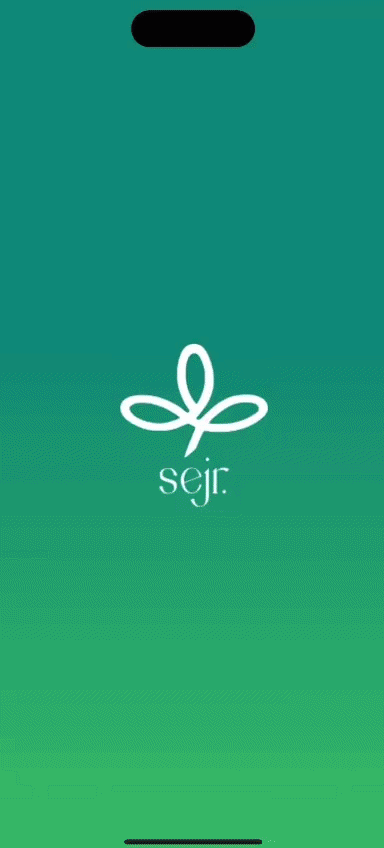

# Sejr Offers Mobile App

> 🚧 **This project is currently under active development. Features, UI, and functionality may continue to evolve and improve over time.**

Sejr Offers is a mobile application that provides users with discounts, vouchers, and loyalty points, and exclusive deals across partner stores.

---

## Features

- User authentication
- Browse partner stores
- Watch a video to unlock all offers
- View available discounts, vouchers, and points
- Redeem exclusive offers
- Smooth mobile experience

---

## Tech Stack

- React Native
- TypeScript
- Expo
- Appwrite

---

## Demo



---

## Installation

Clone the repository:

```bash
git clone https://github.com/emanaradi/Sejr.git
```

Navigate to the project folder:

```bash
cd Sejr
```

Install dependencies:

```bash
npm install
```

Start the development server:

```bash
npx expo start
```

---

## Project Structure

```bash
src
├── app
├── assets
├── components
├── constants
├── hooks
└── lib
```
